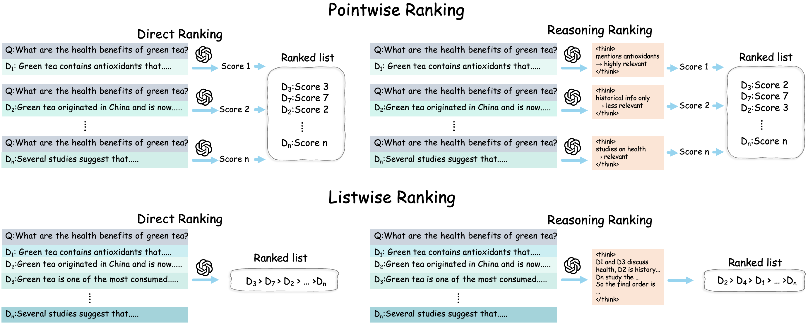

# Rethinking Reasoning in Document Ranking: Why Chain-of-Thought Falls Short
<p align="center">
  <a href="https://arxiv.org/abs/2510.08985">
    
  </a>
  <a href="LICENSE">
    
  </a>
  <a href="#code-coming-soon">
    
  </a>
</p>
## Introduction

Large Language Models (LLMs) are increasingly employed in Information Retrieval (IR) pipelines, especially for reranking, where rerankers refine initial retrieval results. Inspired by the success of large reasoning models (LRMs), recent work has begun adding explicit chain-of-thought (CoT) reasoning into rerankers, hoping that step-by-step reasoning might yield better judgments. Yet, whether reasoning truly helps ranking remains unclear.

In this study, we conduct a systematic analysis of reasoning in reranking across pointwise and listwise paradigms, under both supervised and reinforcement learning. Surprisingly, we find that reasoning-augmented rerankers consistently underperform their direct, non-reasoning counterparts—despite much higher inference cost. 

<div align="center">
  
  <p><em> Figure 1: Illustration of Pointwise and Listwise Reranking (Direct vs. Reasoning </em></p>
</div>

## Key Findings
- **Reasoning Failure**: Direct-output rerankers consistently outperform reasoning-augmented variants, despite the latter’s substantially higher inference cost
- **Calibration Breakdown**: In pointwise rerankers, reasoning improves local relevance prediction but disrupts score calibration, creating a bias toward false positives and degrading overall ranking performance.
- **Generalization Collapse**: In listwise rerankers, reasoning enhances in-domain fit but increases prediction variance and harms out-of-domain generalization—even when rationales are shortened via GRPO.

## TODO List
- [ ] Release training & evaluation code
- [ ] Release open-source models
- [ ] Provide documentation & usage examples 


## Citation
```bibtex
@misc{lu2025rethinkingreasoningdocumentranking,
      title={Rethinking Reasoning in Document Ranking: Why Chain-of-Thought Falls Short}, 
      author={Xuan Lu and Haohang Huang and Rui Meng and Yaohui Jin and Wenjun Zeng and Xiaoyu Shen},
      year={2025},
      eprint={2510.08985},
      archivePrefix={arXiv},
      primaryClass={cs.IR},
      url={https://arxiv.org/abs/2510.08985}, 
}
```
